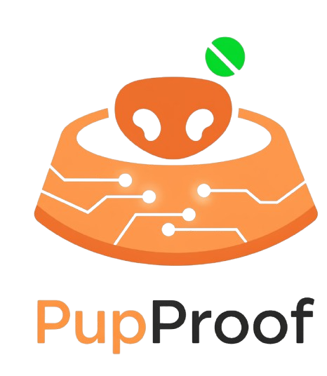

#  PupProof – Blockchain-Powered Smart Dog Feeder

## 📝Overview  
**PupProof** is a next-gen smart dog feeder that fuses **IoT, AI, and Blockchain** to ensure fair feeding, transparent proof storage, and gamified rewards.  

- 1. **Arduino + Servo Motor** vending prototype  
- 2. **Azure Computer Vision** → Puppy vs. Adult detection  
- 3. **MongoDB** → Prevents duplicate feeding within timeframe  
- 4. **IPFS (Pinata)** → Tamper-proof refill proofs  
- 5. **MetaMask login** → Wallet-based identity  
- 6. **PupCoins** → Reward system with ERC-20 upgrade path  

---

## ✨ Key Features  

### 🐕 IoT + AI  
- Arduino Nano + Servo Motor for food dispensing  
- LED indicator for refill confirmation  
- Azure CV validates uploaded dog images  

### 🗂️ Fairness Control  
- MongoDB prevents repeated feeding attempts  
- Logs every request with **userId, timestamp, machineId**  

### 🌐 Blockchain Power  
- **IPFS + Pinata** → Immutable refill proofs  
- **MetaMask** → Decentralized login & wallet mapping  
- **PupCoins** → Gamified rewards → future ERC-20 tokens  

### 🎮 Gamification  
- PupCoins credited for verified refills  
- User dashboard shows activity & rewards  
- Admin verifies proofs before rewarding  

---

## 🖼️ Workflow  

1. User logs in with MetaMask → uploads dog image  
2. Azure CV validates → Arduino feeder dispenses food (LED blinks)  
3. Proof image stored on **IPFS** → CID saved in MongoDB  
4. Admin reviews → Rewards (PupCoins) sent to user’s wallet  

---

## 🛠️ Tech Stack  

- **Frontend**: HTML, CSS, EJS, JavaScript  
- **Backend**: Node.js, Express.js  
- **Database**: MongoDB  
- **AI**: Azure Computer Vision API  
- **IoT**: Arduino Nano, Servo Motor, LED  
- **Blockchain**: IPFS (Pinata), MetaMask, ERC-20 (future upgrade)  

---

## ⚡ Quick Start  

```bash
# Clone the repo
git clone https://github.com/yourusername/pupproof.git
cd pupproof
```
# Install dependencies
```
npm install
```
# Run server
```
npm start
```
