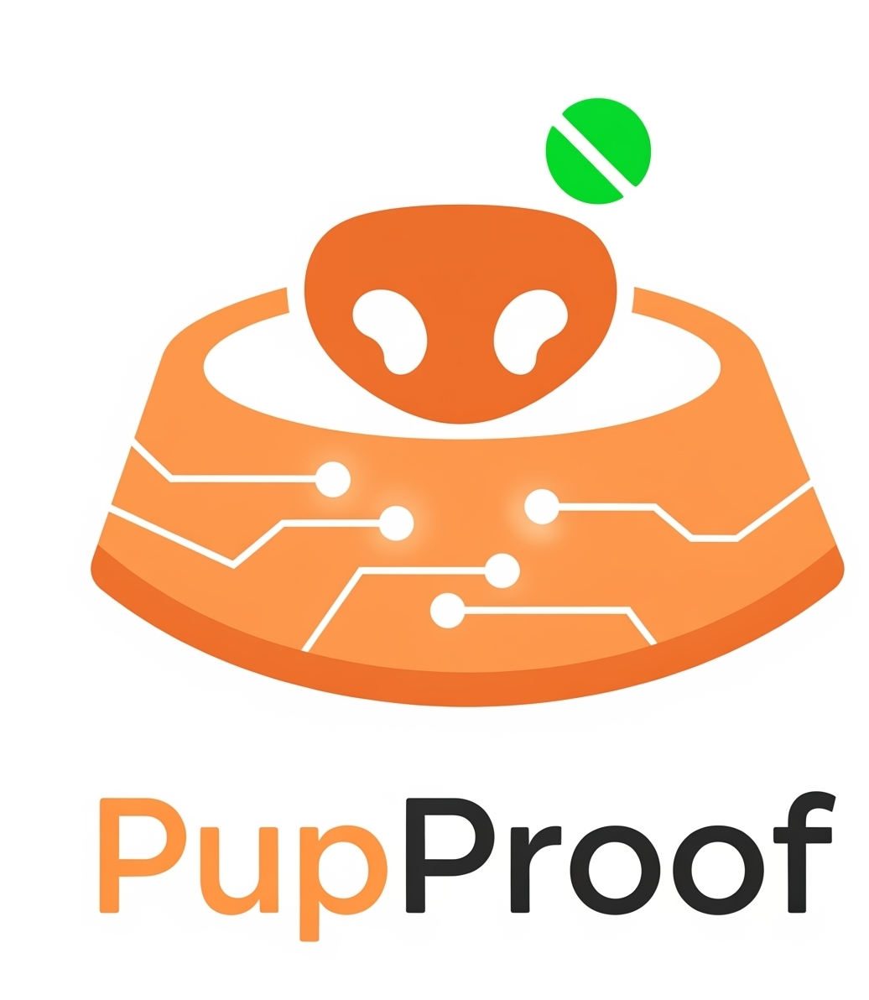
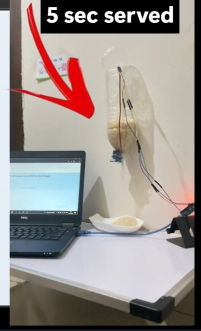
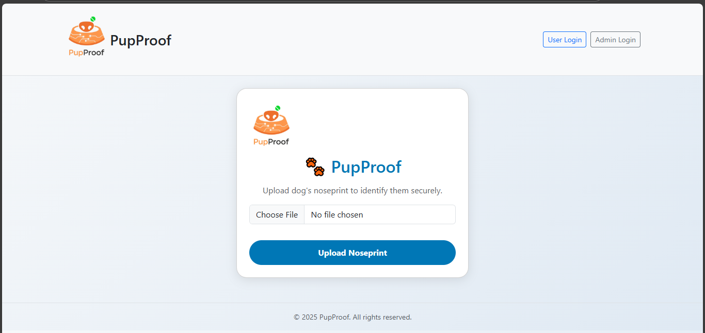

#  PupProof – Blockchain-Powered Smart Dog Feeder

## 📝Overview  
**PupProof** is a next-gen smart dog feeder that fuses **IoT, AI, and Blockchain** to ensure fair feeding, transparent proof storage, and gamified rewards.  

-  **Arduino + Servo Motor** vending prototype  
-  **Azure Computer Vision** → Puppy vs. Adult detection  
-  **MongoDB** → Prevents duplicate feeding within timeframe  
-  **IPFS (Pinata)** → Tamper-proof refill proofs  
-  **MetaMask login** → Wallet-based identity  
-  **PupCoins** → Reward system tokens

---
## Preview

<p align="center">
  
  
</p>

---
## ✨ Key Features  

### 🐕 IoT + AI  
- Arduino Nano + Servo Motor for food dispensing    
- Azure CV validates uploaded dog images  

### 🗂️ Fairness Control  
- MongoDB prevents repeated feeding attempts  
- Logs every request with **userId, timestamp, machineId**  

### 🌐 Blockchain Power  
- **IPFS + Pinata** → Immutable refill proofs  
- **MetaMask** → Decentralized login & wallet mapping  
- **PupCoins** → Gamified rewards → tokens

### 🎮 Gamification  
- PupCoins credited for verified refills  
- User dashboard shows activity & rewards  
- Admin verifies proofs before rewarding  

---

## 🖼️ Workflow  

1. **🐕 Dog Approaches System**  
   - Current: User uploads a **noseprint image**  
   - Future: Sensors/camera will capture noseprint automatically  

2. **🤖 Dog Identification**  
   - **Azure CV** classifies →  
     - Puppy → *3 sec feed / 3 hr cooldown*  
     - Adult → *5 sec feed / 5 hr cooldown*  
   - **MongoDB** checks last feed record → If dog already fed, cooldown time is shown  

3. **⚙️ Feeding via IoT**  
   - If eligible → **Node.js** communicates with **Arduino (serial port)**  
   - Servo motor dispenses food for required duration  

4. **🔒 Proof Generation**  
   - Captured noseprint → Uploaded to **IPFS via Pinata**  
   - CID stored in **MongoDB** → Immutable & tamper-proof record  

5. **🌍 Community Refill Action**  
   - Users nearby can **refill the food machine**  
   - Upload **before/after images** → Stored on IPFS  
   - CID logged in database  

6. **🛡️ Admin Verification**  
   - Admin reviews refill proofs  
   - ✅ If valid → Approves refill & rewards user  
   - ❌ If invalid → Penalty applied (*-0.5 PupCoins*)  

7. **🎮 Rewards (Blockchain Simulation)**  
   - Users log in via **MetaMask wallet**  
   - **PupCoins** (simulated tokens) credited to balance  
   - Real-time balance & activity visible on **user dashboard**  


## 🛠️ Tech Stack  

- **Frontend**: HTML, CSS, EJS, JavaScript  
- **Backend**: Node.js, Express.js  
- **Database**: MongoDB  
- **AI**: Azure Computer Vision API  
- **IoT**: Arduino Nano, Servo Motor, LED  
- **Blockchain**: IPFS (Pinata), MetaMask with simulated tokens

---

## ⚡ Quick Start  

```bash
# Clone the repo
git clone https://github.com/yourusername/pupproof.git
cd pupproof
```
# Install dependencies
```
npm install
```
# Run server
```
node server.js
```
